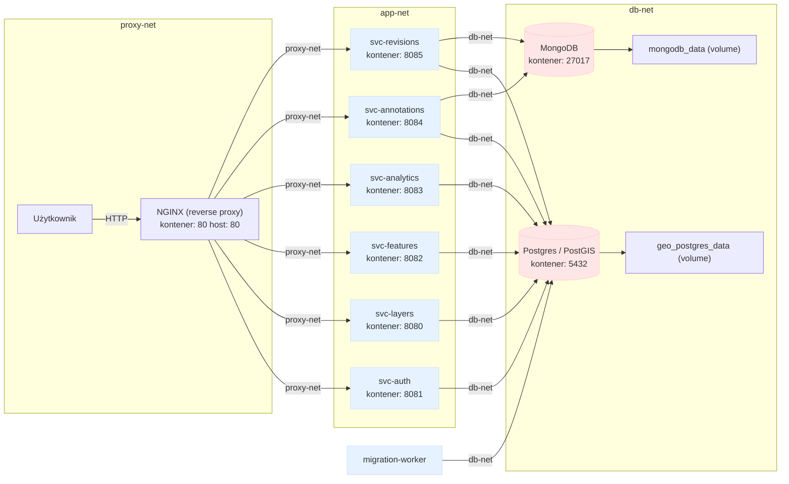

# Diagram architektury

```mermaid
graph LR
  subgraph proxy-net
    user["Użytkownik"] -->|HTTP| nginx["NGINX (reverse proxy)\nkontener: 80 host: 80"]
  end

  subgraph app-net
    nginx -->|proxy-net| svc_auth["svc-auth\n kontener: 8081"]
    nginx -->|proxy-net| svc_layers["svc-layers\n kontener: 8080"]
    nginx -->|proxy-net| svc_features["svc-features\n kontener: 8082"]
    nginx -->|proxy-net| svc_analytics["svc-analytics\n kontener: 8083"]
    nginx -->|proxy-net| svc_annotations["svc-annotations\n kontener: 8084"]
    nginx -->|proxy-net| svc_revisions["svc-revisions\n kontener: 8085"]
  end

  subgraph db-net
    postgres[("Postgres / PostGIS\n kontener: 5432")]
    mongo[("MongoDB\n kontener: 27017")]
    geo_volume["geo_postgres_data (volume)"]
    mongo_volume["mongodb_data (volume)"]
  end

  migration_worker["migration-worker"]

  %% Connections to databases
  svc_auth -->|db-net| postgres
  svc_layers -->|db-net| postgres
  svc_features -->|db-net| postgres
  svc_analytics -->|db-net| postgres
  svc_annotations -->|db-net| postgres
  svc_revisions -->|db-net| postgres
  migration_worker -->|db-net| postgres


  svc_annotations -->|db-net| mongo
  svc_revisions -->|db-net| mongo

  %% Volumes
  postgres --> geo_volume
  mongo --> mongo_volume


  classDef db fill:#ffe6e6,stroke:#ffcccc;
  class postgres,mongo db

  classDef svc fill:#e6f2ff,stroke:#cce0ff;
  class svc_auth,svc_layers,svc_features,svc_analytics,svc_annotations,svc_revisions,migration_worker svc

```